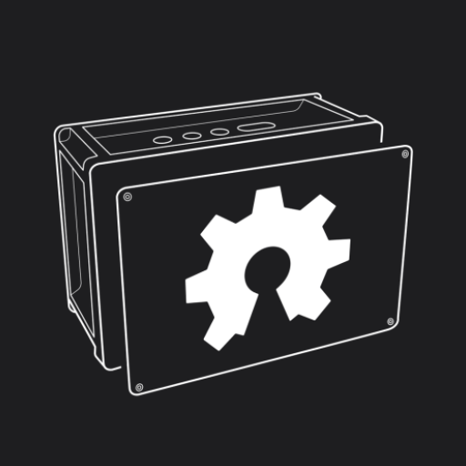
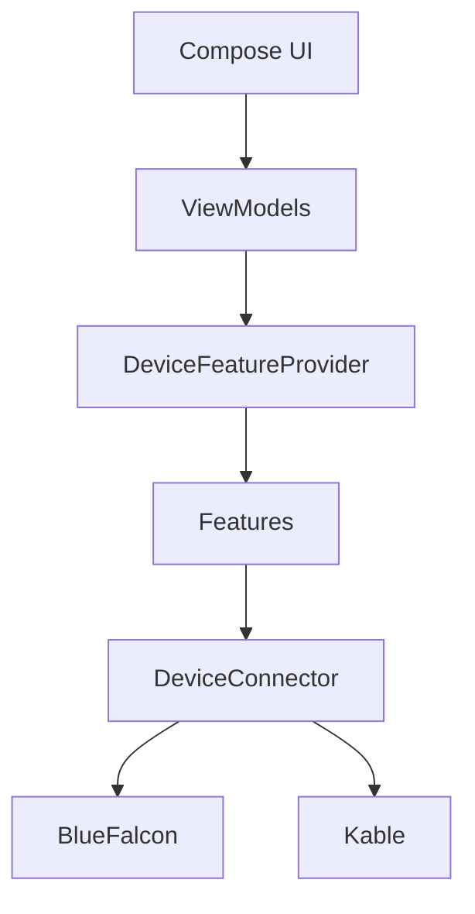
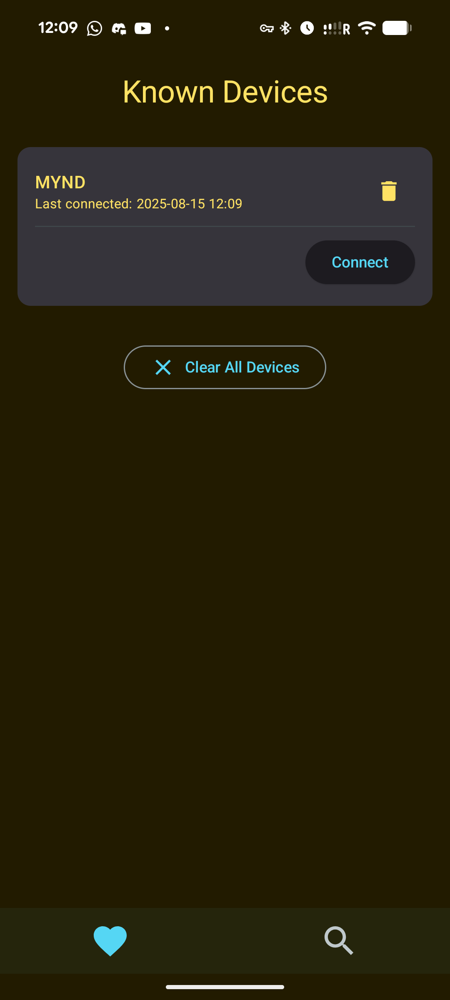
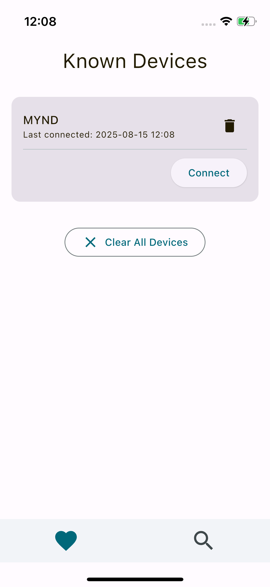
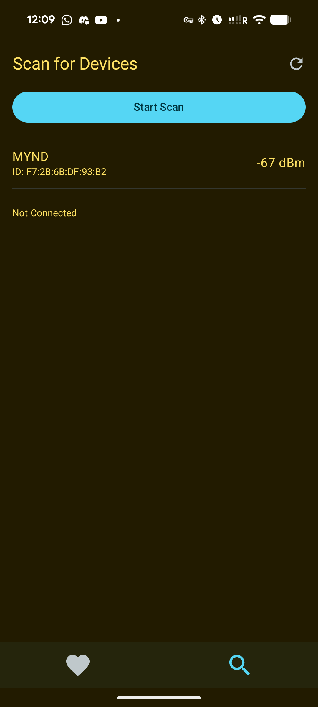
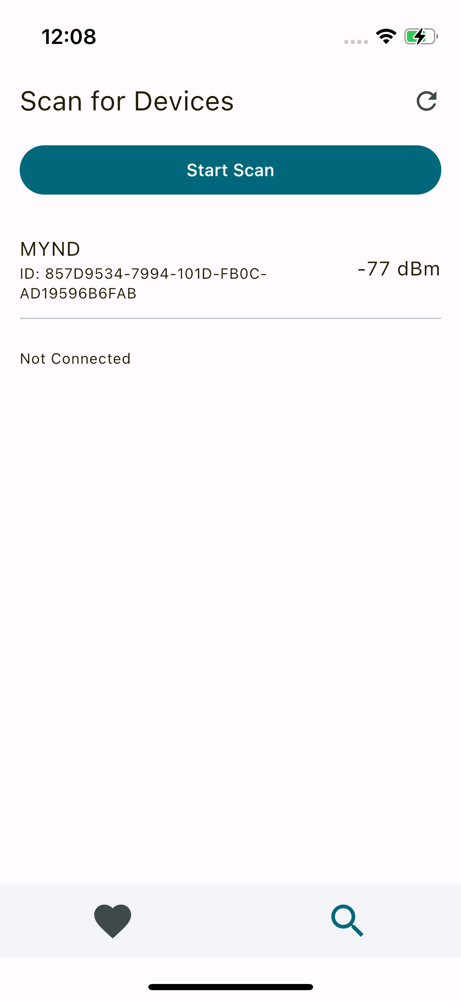
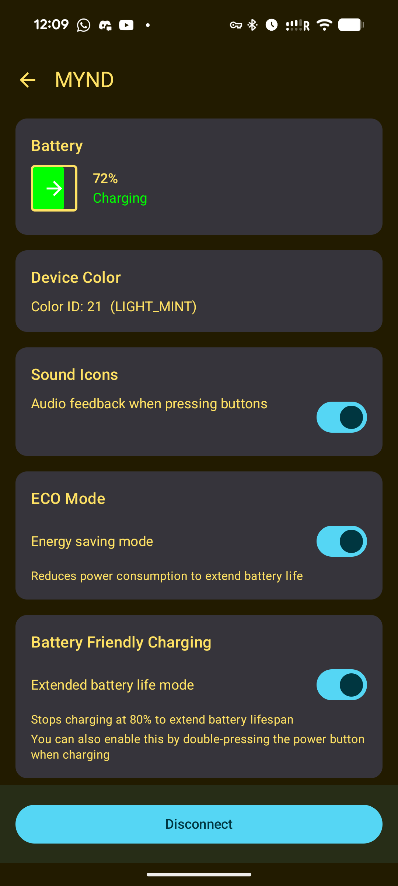
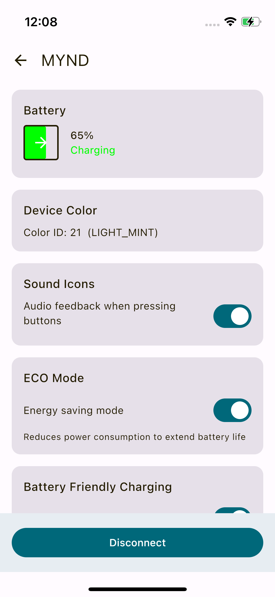

# OpenMynd — Bluetooth controller for the MYND Open Hardware Project

<table>
<tr>
<td valign="top" style="padding-right: 16px"></td>
<td valign="top">An OSS Kotlin Multiplatform app for discovering, connecting, and controlling the MYND open-source hardware over Bluetooth LE using a modern Compose Multiplatform UI.</td>
</tr>
</table>

  
  
  
  
  
  
  

## Features

- Scan for and connect to supported MYND devices
- Feature-driven controls, including:
  - Auto‑off timer
  - Battery and charging status
  - Battery‑friendly charging
  - Bluetooth and MCU firmware versions
  - Device color
  - ECO mode
  - EQ gain
  - LED brightness
  - Master volume and mute
  - Multipoint
  - PartyLink broadcast
  - Sound icons
  - Source selection

## Architecture

Feature‑driven, testable KMP architecture with a clear separation of concerns.

Key points:

- UI in `composeApp/src/commonMain` uses Compose Multiplatform with Voyager tabs/navigation.
- DI via Koin wires the `DeviceConnector` implementation and feature modules.
- `DeviceConnector` abstracts BLE and exposes state/operations used by features.
- Two BLE backends are available; BlueFalcon is default and optimized for Android+iOS here.
- The protocol layer implements MYND’s Actions protocol (command/response over a dedicated service/characteristics).
- You can find a full spec for this protocol and connection in [`specs/mynd.txt`](specs/mynd.txt).

### Bluetooth LE backends

- Default: BlueFalcon (`BlueFalconDeviceConnector`)
- Alternative: Kable (`KableDeviceConnector`)
- Switch at:
  - `composeApp/src/commonMain/kotlin/de/teufel/openmynd/modules/core/di/DeviceConnectorModule.kt`
  - Set `selectedBackend` to `ConnectorBackend.KABLE` (default is `ConnectorBackend.BLUE_FALCON`).
- Note: Seems with Kable we cannot raise MTU (e.g. to 512), which means we fail to communicate with MYND.

### Permissions

- Android: Requests Bluetooth runtime permissions in app (scan/connect; location may be needed on older OS versions). Accept them on first launch via the permissions screen.
- iOS: Ensure Bluetooth usage descriptions are present in your app’s `Info.plist` when shipping to users.

## Screenshots

| Android (Dark) | iOS (Light) |
| --- | --- |
|  |  |
|  |  |
|  |  |

## Build and run

### Prerequisites

- JDK 17+
- Android Studio (Giraffe/Koala+ recommended) with Kotlin Multiplatform support
- Xcode (for iOS simulator/device)
- Android SDK installed and `local.properties` pointing to it
- Optional: run [`KDoctor`](https://github.com/Kotlin/kdoctor) for environment checks

### Android

- Assemble debug APK:
  - `./gradlew :composeApp:assembleDebug`
  - Output: `composeApp/build/outputs/apk/debug/composeApp-debug.apk`
- Run from Android Studio using the `composeApp` configuration
- Gradle Android config:
  - `compileSdk = 35`, `targetSdk = 34`, `minSdk = 24`
  - App id: `de.teufel.openmynd.androidApp`

### iOS

- Open `iosApp/iosApp.xcodeproj` and run the `iosApp` scheme (device or simulator)
- Or run from Android Studio’s iOS run configuration (KMP plugin)
- Simulator tests:
  - `./gradlew :composeApp:iosSimulatorArm64Test`

## Tech stack

- [Compose Multiplatform UI](https://www.jetbrains.com/compose-multiplatform/) (Material 3, resources)
- [Koin](https://github.com/InsertKoinIO/koin) dependency injection, Kotlinx [Coroutines](https://github.com/Kotlin/kotlinx.coroutines)/[Serialization](https://github.com/Kotlin/kotlinx.serialization)
- [Voyager](https://github.com/adrielcafe/voyager) navigation/tabs, [Napier](https://github.com/AAkira/Napier) logging, [Kermit](https://github.com/touchlab/Kermit)
- BLE: [BlueFalcon](https://github.com/Reedyuk/blue-falcon) (default) and [Kable](https://github.com/JuulLabs/kable) (alternative)

## Project layout

- `composeApp/` — shared KMP module (Android + iOS)
  - `.../modules/core` — BLE, device models, features, protocol
  - `.../modules/screens` — screens and feature UIs
  - `.../modules/navigation` — tabs and root navigation
  - `.../modules/ui` — common UI components, theme
- `iosApp/` — iOS host app (Xcode project)

## Contributing

- For now, This repo is not actively maintained. Please fork it and feel free to make your own version. It is just provided as a reference.

## License

MIT — see [`LICENSE`](LICENSE).

