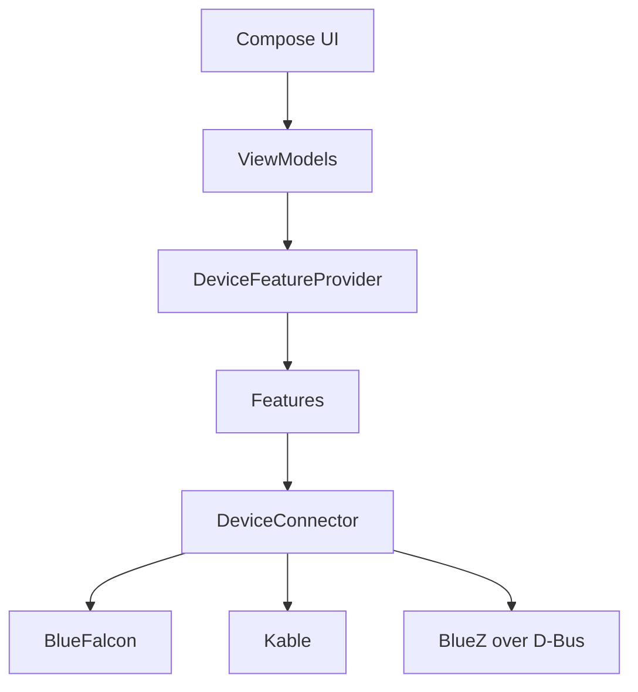

# OpenMynd — Bluetooth controller for the MYND Open Hardware Project

<table>
<tr>
<td valign="top" style="padding-right: 16px"></td>
<td valign="top">An OSS Kotlin Multiplatform app for discovering, connecting, and controlling the MYND open-source hardware over Bluetooth LE using a modern Compose Multiplatform UI.<br/><br/>This fork adds a <b>Linux desktop client</b> (KDE Plasma first, works on GNOME and other desktops) that talks to the speaker through BlueZ.</td>
</tr>
</table>

<p>
  <a href="https://kotlinlang.org/"></a>
  <a href="https://www.jetbrains.com/lp/compose-multiplatform/"></a>
  <a href="https://developer.android.com/"></a>
  <a href="https://developer.apple.com/xcode/"></a>
  <a href="#linux-desktop"></a>
  <a href="https://insert-koin.io/"></a>
  <a href="https://github.com/Kotlin/kotlinx.coroutines"></a>
  <a href="https://opensource.org/license/mit"></a>
</p>

## Features

- Scan for and connect to supported MYND devices
- Feature-driven controls, including:
  - Auto‑off timer
  - Battery and charging status
  - Battery‑friendly charging
  - Bluetooth and MCU firmware versions
  - Device color
  - ECO mode
  - EQ gain
  - LED brightness
  - Master volume and mute
  - Multipoint
  - PartyLink broadcast
  - Sound icons
  - Source selection

## Architecture

Feature‑driven, testable KMP architecture with a clear separation of concerns.



Key points:

- UI in `composeApp/src/commonMain` uses Compose Multiplatform with Voyager tabs/navigation.
- DI via Koin wires the `DeviceConnector` implementation and feature modules.
- `DeviceConnector` abstracts BLE and exposes state/operations used by features.
- Two BLE backends are available on mobile; BlueFalcon is default and optimized for Android+iOS here.
- The Linux desktop client uses its own backend, `BlueZDeviceConnector`, which talks to BlueZ (bluetoothd) over the D-Bus system bus.
- The protocol layer implements MYND’s Actions protocol (command/response over a dedicated service/characteristics).
- You can find a full spec for this protocol and connection in [`specs/mynd.txt`](specs/mynd.txt).

### Bluetooth LE backends

- Default: BlueFalcon (`BlueFalconDeviceConnector`)
- Alternative: Kable (`KableDeviceConnector`)
- Linux: BlueZ (`BlueZDeviceConnector`, always used on desktop)
- Switch the mobile backend at:
  - `composeApp/src/commonMain/kotlin/de/teufel/openmynd/modules/core/di/DeviceConnectorModule.kt`
  - Set `selectedBackend` to `ConnectorBackend.KABLE` (default is `ConnectorBackend.BLUE_FALCON`).
- Note: Seems with Kable we cannot raise MTU (e.g. to 512), which means we fail to communicate with MYND.

### Permissions

- Android: Requests Bluetooth runtime permissions in app (scan/connect; location may be needed on older OS versions). Accept them on first launch via the permissions screen.
- iOS: Ensure Bluetooth usage descriptions are present in your app’s `Info.plist` when shipping to users.
- Linux: No runtime permissions. The app checks that BlueZ is running and the adapter is powered, and offers to switch Bluetooth on.

## Screenshots

| Android (Dark) | iOS (Light) |
| --- | --- |
|  |  |
|  |  |
|  |  |

## Linux desktop

The Linux client is the same Compose app running on the JVM, with a BlueZ backend and desktop integration:

- Bluetooth through BlueZ over D-Bus. No root and no extra permissions are needed for the logged-in desktop user.
- Native file dialog (for firmware updates) through the XDG desktop portal: the KDE dialog on Plasma, GTK's on GNOME.
- Follows the desktop's light/dark setting live (XDG portal, with a fallback that reads Plasma's `kdeglobals`).
- Proper taskbar icon and window grouping on Plasma; detects fractional scaling for XWayland apps.

### Install on Arch Linux (AUR)

The AUR package definition lives in [`packaging/aur/openmynd-git`](packaging/aur/openmynd-git). To build and install it locally:

```sh
git clone https://github.com/erenorgul-source/mynd-app-linux.git
cd mynd-app-linux/packaging/aur/openmynd-git
makepkg -si
```

Once published to the AUR, `yay -S openmynd-git` (or any other AUR helper) works too.

### Requirements

- BlueZ 5.56 or newer, with the service running: `sudo systemctl enable --now bluetooth.service`
- A Bluetooth 4.0+ (LE) adapter
- Java 17+ runtime (the AUR package depends on it; the `.deb`/`.rpm` bundle their own)
- Recommended: `xdg-desktop-portal-kde` (Plasma) or `xdg-desktop-portal-gtk` for native dialogs and dark mode

### Build from source

```sh
./gradlew :composeApp:run                          # run the app
./gradlew :composeApp:desktopTest                  # BlueZ/portal tests (use a private dbus-daemon)
./gradlew :composeApp:packageUberJarForCurrentOS   # single runnable jar
./gradlew :composeApp:packageDeb :composeApp:packageRpm
```

No Android SDK is needed. The Android target is only enabled when an SDK is found (or with `-Popenmynd.android=true`), and iOS targets only on macOS.

### Troubleshooting

- **"Bluetooth service not available"**: bluetoothd isn't running; see Requirements above.
- **Speaker not found**: only BLE advertisements named `TMYND_BLE` are listed. The speaker's classic Bluetooth audio connection ("MYND") is separate and not needed for control.
- **Pairing prompts**: the app doesn't force pairing. If the speaker asks for it, the desktop's Bluetooth agent (Plasma's BlueDevil, GNOME Settings, blueman) handles it.
- **Blurry or tiny UI**: set `OPENMYND_SCALE=1.5` (or another factor).
- **Wrong theme**: set `OPENMYND_THEME=dark` or `light`.
- **D-Bus debugging**: `OPENMYND_DBUS_LOG=debug openmynd`.

## Build and run

### Prerequisites

- JDK 17+
- Android Studio (Giraffe/Koala+ recommended) with Kotlin Multiplatform support
- Xcode (for iOS simulator/device)
- Android SDK installed and `local.properties` pointing to it
- Optional: run [`KDoctor`](https://github.com/Kotlin/kdoctor) for environment checks

### Android

- Assemble debug APK:
  - `./gradlew :composeApp:assembleDebug`
  - Output: `composeApp/build/outputs/apk/debug/composeApp-debug.apk`
- Run from Android Studio using the `composeApp` configuration
- Gradle Android config:
  - `compileSdk = 35`, `targetSdk = 34`, `minSdk = 24`
  - App id: `de.teufel.openmynd.androidApp`

### iOS

- Open `iosApp/iosApp.xcodeproj` and run the `iosApp` scheme (device or simulator)
- Or run from Android Studio’s iOS run configuration (KMP plugin)
- Simulator tests:
  - `./gradlew :composeApp:iosSimulatorArm64Test`

## Tech stack

- [Compose Multiplatform UI](https://www.jetbrains.com/compose-multiplatform/) (Material 3, resources)
- [Koin](https://github.com/InsertKoinIO/koin) dependency injection, Kotlinx [Coroutines](https://github.com/Kotlin/kotlinx.coroutines)/[Serialization](https://github.com/Kotlin/kotlinx.serialization)
- [Voyager](https://github.com/adrielcafe/voyager) navigation/tabs, [Napier](https://github.com/AAkira/Napier) logging, [Kermit](https://github.com/touchlab/Kermit)
- BLE: [BlueFalcon](https://github.com/Reedyuk/blue-falcon) (default) and [Kable](https://github.com/JuulLabs/kable) (alternative)

## Project layout

- `composeApp/` — shared KMP module (Android, iOS, Linux desktop)
  - `src/commonMain` — code shared by all platforms
  - `src/mobileMain` — Android + iOS only (BlueFalcon/Kable, runtime permissions)
  - `src/desktopMain` — Linux desktop: BlueZ backend, XDG portal, window/entry point
  - `.../modules/core` — BLE, device models, features, protocol
  - `.../modules/screens` — screens and feature UIs
  - `.../modules/navigation` — tabs and root navigation
  - `.../modules/ui` — common UI components, theme
- `iosApp/` — iOS host app (Xcode project)
- `packaging/` — Linux desktop entry, AppStream metadata, icons, launcher and the AUR `PKGBUILD`

## Contributing

- For now, This repo is not actively maintained. Please fork it and feel free to make your own version. It is just provided as a reference.

## License

MIT — see [`LICENSE`](LICENSE).

